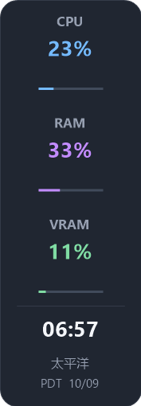
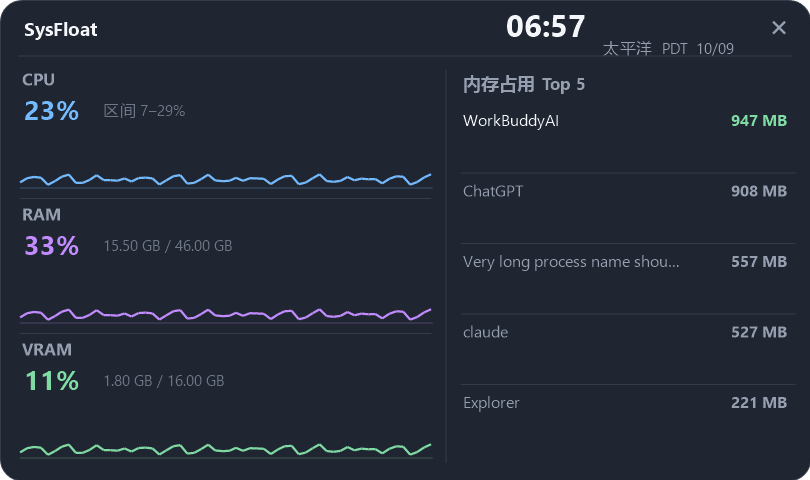
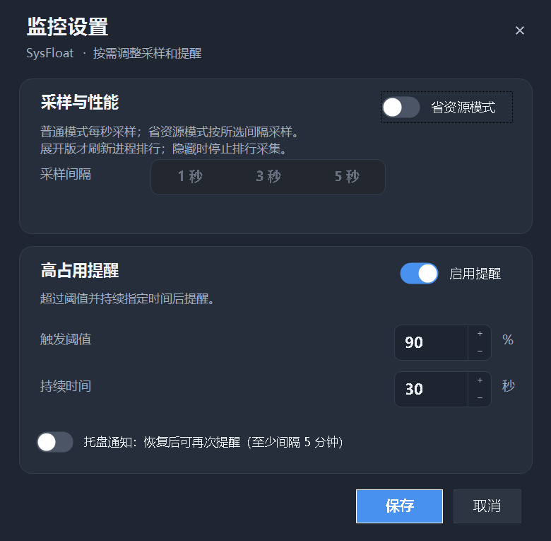

# SysFloat

一个放在桌面上的 Windows 系统资源悬浮窗，同时显示美国太平洋时间。

## 为什么做这个软件

我做 SysFloat 的初衷很简单：**方便随时查看电脑的系统资源情况。**

日常开发、运行 AI 工具或者同时打开多个应用时，我想直接看到 CPU、内存和显存的占用，不用反复打开任务管理器。SysFloat 可以放在桌面角落，按需要切换横版、竖版或展开版。

我平时也会使用 **Codex 和 Claude**，所以加了一只美国太平洋时钟，方便使用这些工具时留意美区时间、查看标注了太平洋时区的公告或安排。它是一只时间参考时钟，**不会读取账号，也不会查询或推断 Codex、Claude 的额度、计费或重置时间**。

## 下载和使用

前往 [Releases](https://github.com/knownothing20/SysFloat/releases/latest) 下载 `SysFloat.exe`，保存到任意可写目录，双击运行即可。

- 适用于 **64 位 Windows**。
- 发布版为 **win-x64 自包含单文件**，不需要额外安装 .NET。
- exe 约 **146 MB**，包含 Windows Desktop 运行时；文件大小不等于运行内存占用。
- 发布附件同时提供 SHA-256 校验文件。
- 程序未签名，首次运行时 Windows 可能显示安全提示；请核对下载来源和校验值。

## 功能

| 功能 | 说明 |
| --- | --- |
| 系统资源 | CPU 使用率、物理内存使用率、显存使用率 |
| 三种布局 | 横版、竖版、展开版，可通过右键菜单切换 |
| 太平洋时钟 | 24 小时制、当地日期、PST/PDT 自动切换 |
| 悬停详情 | 查看内存和显存已用/总量、CPU 最近采样区间、完整时间与时差 |
| 展开版 | 查看最近采样趋势和内存占用最高的 5 个进程 |
| 高占用提醒 | 设置阈值和持续时间，连续超限后对应数值与托盘图标变橙 |
| 可选托盘通知 | 默认关闭；开启后最多每 5 分钟一次，通知显示也受 Windows 系统设置影响 |
| 省资源模式 | 可选 1、3、5 秒采样；普通模式每秒采样 |
| 按需刷新 | 仅展开版可见时扫描进程排行；悬浮窗隐藏时停止绘图和时钟刷新 |
| 窗口选项 | 拖动、锁定位置、始终置顶、透明度设置 |

### 界面预览

**横版**


**竖版**



**展开版**



**监控设置**



截图中的时间和资源数值只是截图当时的数据，实际运行会更新。

### 常用操作

- 右键悬浮窗或托盘图标：切换布局、调整透明度或打开 **监控设置…**。
- 点击托盘图标：显示或隐藏悬浮窗。
- 双击托盘图标：把窗口移回可见区域。
- 展开版右上角的 `×`：隐藏窗口，后台监控和提醒继续工作。
- 彻底退出：选择右键菜单中的 **退出**。

### 提醒与省资源模式

默认提醒阈值为 **90%**，持续时间为 **30 秒**，托盘通知默认关闭。CPU、内存、显存分别计时；不同指标交替超限不会累积成同一次持续超限。低于阈值或数据不可用时，该指标重新计时。

省资源模式需要在监控设置中打开，再选择采样间隔。更长的间隔减少采样频率，但数值更新和超限恢复判断也会相应延迟。悬浮窗隐藏后仍保留基础采样，以便托盘状态和提醒继续工作。

## 太平洋时间说明

美国有多个时区，SysFloat 显示的是**美国西海岸太平洋当地时间**，不是覆盖全美国的单一时间：

- **PST**：太平洋标准时间，UTC−08:00，比北京时间慢 16 小时。
- **PDT**：太平洋夏令时间，UTC−07:00，比北京时间慢 15 小时。

程序使用 Windows 的 `Pacific Standard Time` 时区规则自动处理夏令时和跨天，不需要联网查询时间。准确度依赖电脑系统时钟和 Windows 时区规则是否正确。时区背景可参考 [NIST 说明](https://www.nist.gov/pml/time-and-frequency-division/local-time-faqs)。

## 数据与隐私

CPU 和物理内存通过 Windows 系统接口读取；显存通过 LibreHardwareMonitor 获取。**VRAM 表示显存使用率，不是 GPU 核心使用率**。显卡或驱动未提供相应传感器时，显示不可用，而不是猜测数值。

展开版的进程排行显示内存工作集，不代表各进程完全独占的物理内存。

设置保存在 `%LOCALAPPDATA%\SysFloat\settings.json`。程序不需要登录，不读取 Codex、Claude 凭证，也没有新增后台联网服务。

## 从源码构建

当前源码目标框架为 `net5.0-windows`，使用 WinForms。**.NET 5 已结束官方支持**；这是现有版本的构建环境，并非建议新项目采用该版本。

安装匹配的 .NET SDK 后，在仓库根目录运行：

```powershell
dotnet build .\SysFloat\SysFloat.csproj -c Release
```

发布可直接复制运行的 x64 单文件：

```powershell
dotnet publish .\SysFloat\SysFloat.csproj -c Release -r win-x64 --self-contained true -p:PublishSingleFile=true -p:IncludeNativeLibrariesForSelfExtract=true -p:PublishTrimmed=false -p:UseAppHost=true -o .\SysFloat\artifacts\publish\win-x64-self-contained
```

也可以运行 `SysFloat\publish.bat`。发布文件位于 `SysFloat\artifacts\publish\win-x64-self-contained\SysFloat.exe`。

### 验证

```powershell
dotnet build .\verification\SysFloat.Verification.csproj -c Release -p:SuppressTfmSupportBuildWarnings=true
.\verification\bin\Release\net5.0-windows\win-x64\SysFloat.Verification.exe
```

验证程序会短暂创建测试窗口和托盘图标，并使用独立设置文件，不会覆盖日常使用的设置。当前覆盖时区冬夏/跨日/重复小时、持续超限提醒、设置保存/取消、采样配置、显存单位、三种布局和设置窗口的 DPI 渲染，以及真实监控与界面的接线。

验证日志和实际渲染截图保存在验证程序输出目录下的 `evidence` 文件夹。

## 主要依赖

- WinForms / .NET Windows Desktop Runtime
- [LibreHardwareMonitor](https://github.com/LibreHardwareMonitor/LibreHardwareMonitor)
- System.Text.Json

第三方依赖的许可证以各自项目和 NuGet 包附带的许可证为准。
